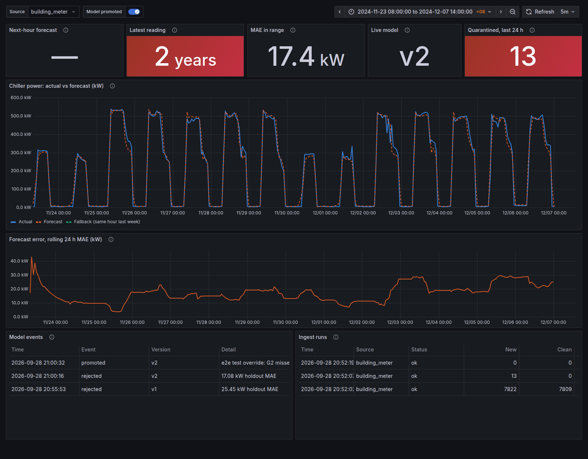

# Online Forecasting Service — Design & Retraining Guardrails

**Branch:** `feature/online-inference-retraining`
**Status:** Phases 1–2 implemented (`service/`, `docker-compose.yml`, `grafana/`); phases 3–4 proposed
**Scope:** Turn the offline chiller-power forecasting notebooks into a web-accessible service that (1) serves forecasts on a dashboard, and (2) retrains itself with MLJAR `supervised` as new sensor data arrives — without silently getting worse.

---

## 1. Facts this design is built on

Checked against `Datasets/Combined.xlsx` and the current firmware / notebooks:

| Fact | Value | Why it matters |
|---|---|---|
| Sampling interval | **1 hour** (7,820 of 7,821 gaps are exactly 1 h) | Retraining cadence, gap rules and lag features are all in hours. |
| History | 2024-01-16 → 2024-12-07, 7,822 rows | ~11 months — the model has never seen a full year of seasonality yet. |
| Target | `activePowerT` (kW), 3.6 – 765 kW | Hard physical bounds for validation. |
| Physics identity | `activePowerT ≈ A + B + C`: p99 error 0.15 kW, max 105 kW | A free, very strong data-quality check (a few rows already fail it). |
| Energy counter | `importActiveEnergyT` never decreases in history | Monotonic counter → detects meter resets and replayed/duplicated data. |
| Ingestion path today | ESP32 → Firebase RTDB (`/UsersData/<uid>/readings`) | Phase 1 can reuse this without touching firmware. |
| MLJAR version | `mljar-supervised` 1.3.2 | Supports custom validation folds (see §4.2). |
| Best offline model | Improved LSTM (MSE 2,847) > MLJAR Compete (MSE 6,045) | MLJAR is the auto-retrained model; the LSTM can join later as a challenger. |
| ESP32 payload | Per-phase `voltage/current/power` (W) + RTC timestamp `d/m/Y H:M:S`, ~1/min; **no** energy counter, total power or line voltages | Every reading carries a `source` (`building_meter` / `esp32`); the model trains on one source, set in `guardrails.yaml`. Energy and line voltages are nullable. |

> **Notebook note:** `TimeSeriesSplit(test_size=14*24*3)` assumes 20-min data, but the data is hourly, so each test fold is actually **42 days**, not 14. Worth fixing (or re-labelling) before the numbers go into the report.

---

## 2. Tech stack decision

### 2.1 Orchestration: Docker Compose vs Kubernetes

| Option | Pros | Cons | Fit |
|---|---|---|---|
| **Docker Compose on one VM** | One file, one command, trivial to debug, cheap (1 VM). | No self-healing across nodes; manual scaling. | ✅ Right size for 1 site, 1 hourly sensor, 1 maintainer. |
| **k3s (lightweight Kubernetes) on one VM** | Real K8s objects (`CronJob`, `Deployment`, resource limits); good report material. | More YAML, ingress/TLS/storage to learn. | ◑ Good "phase 2" once Compose works. |
| **Managed Kubernetes (GKE/EKS/AKS)** | Production-grade HA. | Cost + ops overhead far above the workload. | ✗ Overkill. |

**Recommendation:** build every component as a **container image first**, run them with **Docker Compose**, and keep a `k8s/` folder of manifests that deploy the *same images* to **k3s** when you want the Kubernetes story. The images don't change between the two — only the wiring does. The workload (one reading per hour, one model) does not need a cluster; Kubernetes is a portfolio/learning choice, not a scaling need.

### 2.2 Components

```
            ┌────────────┐   hourly    ┌──────────────┐
 ESP32 ───► │  Firebase  │ ──────────► │  ingester    │── validate ──┐
            │  RTDB      │   pull      │  (Python)    │              │ quarantine
            └────────────┘             └──────────────┘              ▼
                                              │ clean rows   ┌──────────────┐
                                              ▼              │ quarantine   │
                                   ┌──────────────────────┐  │ table        │
                                   │ TimescaleDB          │  └──────────────┘
                                   │ readings | forecasts │
                                   │ metrics  | audit     │
                                   └──────────────────────┘
                      ▲  forecasts          ▲ reads          ▲ reads
          ┌───────────┴───┐        ┌────────┴──────┐   ┌─────┴───────┐
          │ scorer (hourly)│       │ trainer       │   │ Grafana     │ ◄── users (browser)
          │ loads champion │       │ (weekly job)  │   └─────────────┘
          └───────┬────────┘       │ MLJAR + gates │
                  │                └──────┬────────┘   ┌─────────────┐
                  └──── model registry ◄──┘            │ FastAPI     │ ◄── on-demand /predict,
                       (MLflow: champion / challenger) │ (optional)  │     /health, /model
                                                        └─────────────┘
```

| Concern | Choice | Alternatives considered | Why |
|---|---|---|---|
| Time-series storage | **TimescaleDB** (Postgres) | InfluxDB, plain Postgres, keep Firebase only | SQL + time-series functions; Grafana reads it natively; one DB for readings, forecasts, metrics, audit. |
| Model registry & experiment log | **MLflow** (Postgres backend, local volume / MinIO for artifacts) | Folder of pickles, W&B | Versioned models, `champion`/`challenger` aliases, one-command rollback, full run history for the report. |
| Inference | **Batch scorer**, hourly, writes to `forecasts` table | Request-time inference only | The target updates hourly, so precomputing is simpler, cheaper, and the dashboard never waits on a model. |
| API | **FastAPI** (optional in phase 1) | Flask | `/health`, `/model` (which version is live), `/predict` for what-if calls. Typed, auto-docs. |
| Dashboard | **Grafana** with anonymous read-only access | Streamlit, React | Zero-code actual-vs-forecast charts, alerting built in, public read-only dashboards. Add Streamlit later only if you need custom interaction. |
| Scheduling | Compose: `supercronic` container · k3s: `CronJob` | Airflow, Prefect | Three jobs (ingest, score, train) don't justify a workflow engine; MLflow already keeps run history. |
| Data validation | **pandera** schemas + custom physics checks | Great Expectations | Lightweight, lives in Python next to the feature code. |
| Drift monitoring | **Evidently** (or hand-rolled PSI) | — | Drift reports as HTML + numbers written to the `metrics` table for Grafana. |
| Hosting | University VM if IT allows, else a 4 vCPU / 8 GB VM in `asia-southeast1` | — | MLJAR Compete is CPU/RAM heavy; same region as the existing Firebase DB. |

---

## 3. The retraining loop

```
new hourly data ─► validate ─► (enough clean new data?) ─► build features ─► train challenger
                                    │ no → wait                                   │
                                    ▼                                             ▼
                                  skip                         evaluate on the most recent holdout
                                                                                  │
                                         ┌─── fails any gate ───┬─── passes all gates ───┐
                                         ▼                                              ▼
                                  keep champion,                                shadow mode (N days)
                                  log + alert                                           │
                                                                              still better? ─► promote
                                                                                                │
                                                                        live error spikes? ─► auto-rollback
```

Default schedule: **weekly** retrain (Sunday 02:00 MYT), plus an **event trigger** when live error or drift crosses a threshold — with a **cooldown** of at least 24 h between retrains.

---

## 4. Guardrails

Each guardrail is a check that either **blocks** the step (hard) or **logs and alerts** (soft). The thresholds below are starting points derived from the current data; they should live in one `guardrails.yaml` so they're tunable without code changes.

### 4.1 Data guardrails — "only trustworthy data gets into training"

| # | Check | Rule (starting point) | Type |
|---|---|---|---|
| D1 | Schema | All 15 expected columns present, numeric, correct names | Hard (reject batch) |
| D2 | Timestamp sanity | Not in the future (> now + 5 min), no duplicates, aligned to the hour | Hard (reject row) |
| D3 | Physical ranges | Phase voltage 200–270 V; line voltage 350–470 V; current ≥ 0 and ≤ 2,000 A; `activePowerT` 0–1,000 kW | Hard (quarantine row) |
| D4 | Phase-sum identity | `|activePowerT − (A+B+C)| ≤ 2 kW` | Hard (quarantine row) |
| D5 | Power ≤ apparent power | Per phase: `P ≤ V × I / 1000 × 1.05` | Hard (quarantine row) |
| D6 | Energy counter | `importActiveEnergyT` must not decrease (hard). Hourly increase vs mean of the two power snapshots, ± 100% + 5 kWh (soft). A ± 20% rule flagged 8% of 2024 rows: power is an hourly snapshot and the chiller cycles within the hour | Hard (decrease) / soft (rate) |
| D7 | Stuck sensor | Same `activePowerT` for ≥ 6 consecutive hours | Quarantine run |
| D8 | Spikes | Robust z-score (median/MAD, same hour-of-week) > 6 | **Soft** (flag for review). As a hard rule it removed 6% of 2024 rows, nearly all genuine (compressor staging, semester breaks) |
| D9 | Gaps | Gaps are recorded, **never** silently forward-filled into the target | Hard |
| D10 | Completeness | Retrain window must be ≥ 90% complete | Hard (skip retrain) |

Principles:
- **Quarantine, never delete.** Failed rows go to a `quarantine` table with the reason; you can re-admit them after review.
- **Never train on imputed targets.** Imputation is fine for *features*, but a row whose `activePowerT` was filled in is the model learning from its own guess. Carry an `is_imputed` flag and exclude those rows from the training target.
- **Never feed predictions back as data.** Forecasts live in their own table and are never used as inputs to training.

### 4.2 Training guardrails — "the model is trained the way it will be used"

| # | Guardrail | How |
|---|---|---|
| T1 | **Time-ordered validation inside MLJAR** | MLJAR's default `validation_strategy` shuffles rows into k-folds, which lets it pick models using the future to predict the past. Pass time-ordered folds instead: `AutoML(validation_strategy={"validation_type": "custom"})` and `automl.fit(X, y, cv=list(TimeSeriesSplit(...).split(X)))`. |
| T2 | **One feature function** | `create_enhanced_features()` moved into `chiller_forecast/features.py`, used by trainer, scorer and replay. Tests check it matches the notebook, that the scorer's single-row path equals the training rows, and (end to end) replay MAE equals the training holdout MAE. |
| T3 | **No look-ahead** | Test that every feature at time *t* only uses data from before *t* (e.g. perturb the value at *t* and confirm no feature at *t* changes). |
| T4 | **Minimum new data** | Retrain only if ≥ 7 days of new *clean* hours since the last run. |
| T5 | **Training window** | Expanding window capped at 24 months, so seasonal patterns (semester vs. break) are kept but ancient regimes eventually age out. |
| T6 | **Fixed budget** | `total_time_limit`, `random_state`, and algorithm list pinned in config; container CPU/RAM limits so training can't starve the scorer. |
| T7 | **Reproducibility** | Log to MLflow: data snapshot hash + date range, row count, feature list, git SHA, `mljar-supervised` version, all MLJAR params. Any model must be rebuildable. |
| T8 | **Calendar features** | Add Malaysian public holidays and the university's semester / exam / break calendar. A campus chiller's load depends on these more than on month-of-year, and they're a common cause of apparent "drift". |

### 4.3 Promotion gates — "a new model only goes live if it's clearly better"

The challenger and the current champion are scored on the **same most-recent holdout** (last 14 days, never used in training). All gates must pass:

| # | Gate | Rule (starting point) |
|---|---|---|
| G1 | Beats the champion | Challenger MAE ≤ champion MAE × 0.98 (a ≥ 2% improvement, so noise doesn't cause churn) |
| G2 | Beats the naive baseline | MAE ≤ 0.8 × seasonal-naive (same hour last week) MAE — if a model can't beat "copy last week", something is broken |
| G3 | Absolute floor | R² ≥ 0.80 on the holdout |
| G4 | No regression on segments | MAE for working hours (09–22), off-hours, weekdays and weekends each ≤ 1.10 × champion's — stops a model that wins on average but loses at peak load |
| G5 | Unbiased | |mean residual| ≤ 10 kW |
| G6 | Physically plausible | No negative predictions (the served model clamps at 0, so this is on what users see); all predictions ≤ 1.2 × historical max |
| G7 | Stable across windows | Also wins on ≥ 2 of the last 3 weekly backtest windows, not just one |
| G8 | Shadow period | Challenger runs alongside the champion for 3–7 days (predictions logged, not shown); promote only if it still wins on live data |

Early on, make promotion **human-approved** (the gates produce a report; you click approve). Switch to automatic once the gates have proven trustworthy.

### 4.4 Production monitoring — "notice quickly when it goes wrong"

| # | Monitor | Rule | Action |
|---|---|---|---|
| M1 | Live error | Rolling 24 h MAE > 1.5 × validation MAE | Alert; > 2× for 48 h → auto-rollback to previous champion |
| M2 | Feature drift | PSI > 0.2 on key features (target lags, rolling means, voltages) vs training reference | Alert + trigger retrain (still subject to all gates) |
| M3 | Prediction drift | Distribution of forecasts shifts (PSI > 0.2) | Alert |
| M4 | Data freshness | No new reading for > 2 h | Alert (dashboard shows "stale" banner) |
| M5 | Quarantine rate | > 5% of last 24 h quarantined | Alert — likely sensor or firmware issue, and pauses retraining |
| M6 | Pipeline health | Ingest / score / train job failed | Alert |

**Rollback** is a one-line change of the MLflow `champion` alias to the previous version; keep at least the last 5 promoted models.

---

## 5. Repo layout (as built)

```
service/
  src/chiller_forecast/
    features.py        # single source of truth for feature engineering (T2, T3)
    validation.py      # pandera schema + physics checks (D1–D10)
    ingest.py          # Excel backfill + Firebase ESP32 feed → validate → store / quarantine
    db.py, schema.sql  # TimescaleDB access; readings, quarantine, forecasts, audit tables
    train.py           # MLJAR with time-ordered folds, holdout, MLflow registry (T1–T7)
    gates.py           # holdout metrics + promotion gates G1–G6
    model.py           # MLJAR results dir packaged as an MLflow pyfunc
    score.py           # hourly forecast + seasonal-naive fallback; `replay` for past data
    settings.py        # env vars + guardrails.yaml
    __main__.py        # `chiller` CLI
  config/guardrails.yaml
  tests/               # pytest: features, validation, gates, Firebase parsing
  Dockerfile, crontab, constraints.txt, README.md (runbook)
docker-compose.yml     # db, mlflow, init (backfill), scheduler, grafana
deploy/db-init/        # creates the MLflow DB and Grafana's read-only role
grafana/               # provisioned datasource + dashboard
k8s/                   # phase 4
```

## 6. Phased plan

1. ✅ **Foundation** — `features.py` + `validation.py` with tests; TimescaleDB + ingester backfilling from `Combined.xlsx` and pulling the ESP32 feed from Firebase.
2. ✅ **Serve** — MLJAR with time-ordered folds, holdout gates G1–G6, MLflow registry (champion/challenger aliases, `promote` for approval/rollback), hourly scorer with fallback, Grafana dashboard. Deployed with Compose.
3. **Learn** — G7 (multi-window backtest), refit on train + holdout before promotion, monitoring M1–M6 as Grafana alerts, drift (M2/M3), public-holiday and semester-calendar features (T8).
4. **Harden** — shadow mode (G8), auto-rollback, k3s manifests, LSTM as a second challenger.

## 7. Secrets

Done: firmware credentials moved to git-ignored `include/secrets.h` and scrubbed from git history. **Still to do by the owner:** change the exposed eduroam, Wi-Fi and Firebase passwords, restrict the Firebase API key, and lock down the RTDB rules. The service reads Firebase with its own service-account key (a Docker secret, `FIREBASE_SA_FILE`); all service passwords live in a git-ignored `.env`.

## 8. Data splits, outages and the refit (as built)

### 8.1 How the data is split

```
 oldest                                                                  newest
 |<------------------------ training part ------------------------>|<- holdout ->|
 | ... | CV fold 1 | CV fold 2 | CV fold 3 | CV fold 4 | CV fold 5 |   14 days   |
                  each fold: train on everything before it, validate on it
```

* **Holdout = newest 14 days (336 h).** On the 2024 data that's ~4.3% of rows. It is never used to fit or select models; it's used once, for the gates, and the current champion is scored on the *same* hours so the comparison is like-for-like. A champion trained last week never saw these hours either, because its own training data stopped where its holdout began.
* **CV folds are time-ordered** (`TimeSeriesSplit(n_splits=5, test_size=336)`), passed to MLJAR as `validation_strategy={"validation_type": "custom"}` + `fit(..., cv=folds)`. MLJAR's default shuffled k-fold would let it choose models by predicting the past from the future. Stacking is off because it re-uses out-of-fold predictions, which assumes shuffled folds.
* The notebook's `test_size=14*24*3` assumed 20-minute data; the service uses `14*24` (the data is hourly).

### 8.2 Forecast horizon and features

The service forecasts **one hour ahead**, so the last three readings (`lag_1h`–`lag_3h`) are known at scoring time and were added to the notebook's 30 features. Rolling 14-day backtests on the 2024 data (LightGBM, MAE in kW):

| Holdout from | Same hour last week | Notebook features | + `lag_1h`–`lag_3h` |
|---|---|---|---|
| 2024-11-23 | 20.2 | 25.6 | 14.6 |
| 2024-11-09 | 15.4 | 23.4 | 13.0 |
| 2024-10-26 | 61.4 | 39.1 | 18.5 |
| 2024-10-12 | 41.7 | 38.1 | 23.4 |
| 2024-09-28 | 27.7 | 39.7 | 21.2 |
| 2024-09-14 | 52.8 | 44.9 | 29.2 |

Without the recent lags the model lost to "copy last week" in 3 of 6 windows. A day-ahead forecast would need a separate model *without* them.

### 8.3 Outages and gaps

| Situation | What happens |
|---|---|
| Missing hours | Recorded (`ingest_runs.gap_hours`, D9), **never imputed** in the target. Features are computed on a real hourly grid, so a lag is always "n real hours ago" and never silently bridges a gap. |
| Row fails a hard check | Quarantined with its reason; the hour is then a gap. It is skipped on re-ingest until marked `reviewed`. |
| Sensor/ESP32 offline, data later recovered from the SD card | Backfill through the same `ingest` path; already-stored hours are never overwritten. |
| Data stale (> 2 h) at scoring time | The shown forecast falls back to seasonal-naive (same hour last week), labelled `fallback` on the dashboard. |
| Past hours | Never back-filled with forecasts: the live error figures only include forecasts made in advance. `chiller replay` simulates past hours for demos/backtests, stored as role `replay`, never mixed with live rows. |
| Chiller off vs sensor outage | Chiller off = voltage present, low current/power: a real reading, kept. Outage = no reading or implausible voltage: a gap or quarantine. |

### 8.4 Refit (phase 3)

Today the promoted model is the one evaluated on the holdout (trained without the newest 14 days). Phase 3 adds a refit: after a challenger passes the gates, retrain the **winning MLJAR configuration** on train + holdout, check it on a short shadow period (G8), then promote. That uses the newest data without letting it influence which model was chosen.

## 9. What running it showed (2024 data)

* Validation quarantined 13 of 7,822 rows (7 phase-sum mismatches, 6 with P > V·I) and found 16 missing hours.
* The first model (notebook features) was **rejected**: holdout MAE 25.4 kW vs 20.2 kW for "same hour last week" (G2).
* With `lag_1h`–`lag_3h`, MAE fell to 17.1 kW (R² 0.98, bias −0.6 kW) and passed G3, G5 and G6, but missed G2 (17.1 vs the 16.2 kW needed). The gates were not loosened; the override path (`chiller promote`) was used to exercise scoring.
* A full-budget run (10 min, all five algorithms, ~11 min wall time) reached 17.25 kW and was rejected by G1 (not 2% better than the 17.08 kW champion) and G2 — the champion comparison works as intended.
* Replay MAE over the holdout equals the training holdout MAE exactly, confirming the served model is the evaluated one.
* **Lead for phase 3:** a single untuned LightGBM on the same features scored 14.6 kW on the same holdout, which would pass every gate, so MLJAR's ensemble is currently leaving accuracy on the table. Worth trying `mode="Perform"`/`"Optuna"`, a longer budget, or LightGBM as a direct challenger — through the gates, like any other model.



## 10. Firmware follow-ups (not in this branch)

* `firebase_id` restarts at 0 on every reboot, so readings after a reboot **overwrite** older ones in RTDB. Use `Firebase.RTDB.pushJSON` (unique, time-ordered keys) instead.
* The RTC timestamp is `d/m/Y H:M:S` without zero padding. The ingester parses it, but an ISO-8601 string (or epoch seconds) would sort and filter server-side, letting the ingester fetch only new readings instead of the whole node.
* `timerDelay` (18 s) is shorter than the 60 s loop delay, so the effective rate is one reading per minute.
